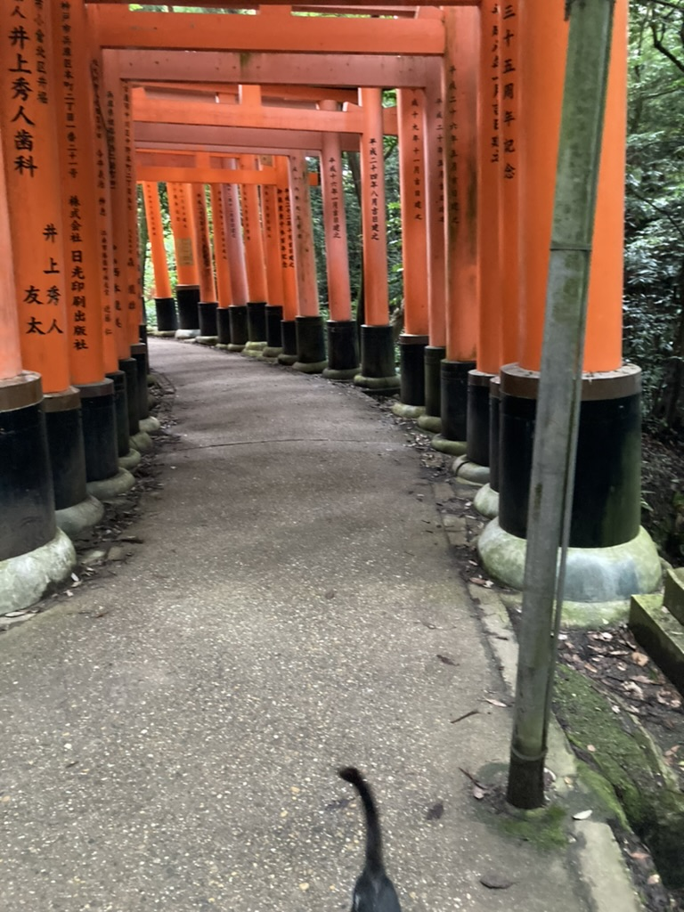
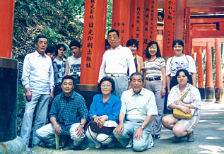
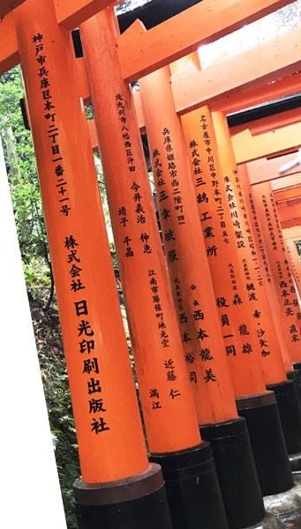
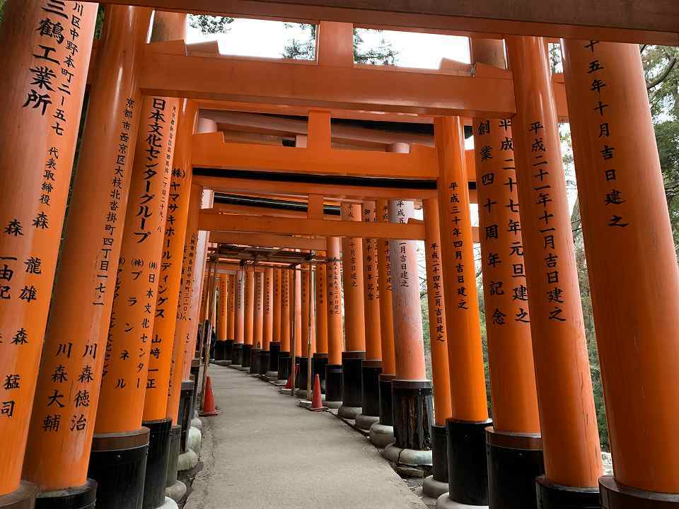

# \[lactf2026] misc/cat-bomb

## <mark style="color:$danger;">Work in Progress</mark>

Flag Objective: Find the coordinates of the photo on Google Street View.

> I was hiking in the woods when I stumbled across this amazing thing: thousands of these orange structures! I stopped to take a photo but then this cat _had_ to photo bomb my otherwise perfect photo with it's tail! Can you find where this photo was taken?
>
> [https://github.com/uclaacm/lactf-archive/tree/main/2026/misc/cat-bomb](https://github.com/uclaacm/lactf-archive/tree/main/2026/misc/cat-bomb)

From the description, this seems to be a straightforward geoguessing challenge, so I skipped EXIF analysis and went straight to the image.

<figure><figcaption></figcaption></figure>

First thing I noticed in the photo is the long corridor of orange gates covered in Japanese characters. A quick search for "Japan orange gates" turns up very similar photos from **Fushimi Inari Taisha** (伏見稲荷大社). This fits the mountain trail setting, and Wikipedia notes that there are more than 800 gates along the route, both confirming the challenge description.

However, Street View coverage on Fushimi Inari Taisha is inconsistent and spotty. Walking the entire route blindly seems impractical. I need to find a way to narrow down the exact location.

After consulting with my LLM, I realized that these gates are donations from businesses. The donor name is written on the left, and the donation date is on the right. That meant the text on nearby gates could serve as helpful leads.

On the first gate, I extracted the text "**井上秀人**" using macOS built in OCR. Googling that name alongside "Fushimi Inari Taisha" suggested it was connected to a dental clicnic, but I couldn't find anything that clearly linked to a location on the trail. So I moved on.

<figure><figcaption>
We even found a group photo taken exactly at where our flag is, now we just need to find the coordinates.
</figcaption></figure>

<figure><figcaption></figcaption></figure>

On the next gate, "**日光印刷出版社**". This produced much more fruitful results. Using Google Images, I located photos of the same gate from different angles, which revealed the donors of the gates further down the path, giving us more company names as leads.

<figure><figcaption></figcaption></figure>

Among them "**三鶴工業所**" turned out to the key. Searching "**三鶴工業所 伏見稲荷大社**" led me to a photo featuring an oversized gate with "**日本文化センターグループ**" written on it. This gate is apparently a landmark for many hikers.

Following the source of that photo brought me to a [Japanese hiking blog](https://cnonbe.exblog.jp/28074976/). In the blog, the author mentioned passing **Kumataka-sha (Bear Hawk Shrine)** and **Takeya Rest House**. Further [research](https://en.japantravel.com/kyoto/the-cats-of-fushimi-inari-taisha/15354), showed that Takeya Rest House is famous for its **resident cats**. Now it makes sense why there is a cat photobombing in a mountain trail. In hindsight, the pressence of a cat is actually a more intentional hint than I initially assumed.

With this new context, I searched for **Kumataka-sha** on Google Street View. From there, it only took a few clicks to reach the gate with "**日光印刷出版社**" written on it and where our [flag](https://www.google.com/maps/@34.9681588,135.7772502,3a,90y,287.22h,85.98t/data=!3m7!1e1!3m5!1sG-tGGMaka6g-1r5XO9f5Vg!2e0!6shttps:%2F%2Fstreetviewpixels-pa.googleapis.com%2Fv1%2Fthumbnail%3Fcb_client%3Dmaps_sv.tactile%26w%3D900%26h%3D600%26pitch%3D4.019999999999996%26panoid%3DG-tGGMaka6g-1r5XO9f5Vg%26yaw%3D287.22!7i13312!8i6656?entry=ttu\&g_ep=EgoyMDI2MDIxMS4wIKXMDSoASAFQAw%3D%3D) is.

> **`lactf{34.9681588,135.7772502}`**
