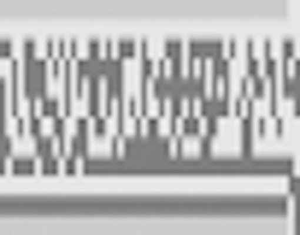

# \[GPNCTF 2026] misc/organized

For this CTF, our team decided to register an Organic team because a balanced diet of ai slop and fiber is crucial for one's health. That means minimal usage of AI. While switching back to artisan programming seems daunting at first, this retro way of doing things does have its benefits. More experienced members like Angus and Lyndon acted like like a human LLM to answer our questions.

The chall I have chosen to tackle is a steg challenge. We are merely given a binary file and nothing else. Here is the chall description and the attached file.

> Organized by MisterPine
>
> \
> Isn't this just a file of random data? Well, maybe you just don't appreciate the organization in your life.&#x20;
>
> [Download ](https://gpn24.ctf.kitctf.de/api/challenges/handout/organized)

Beside judging  how I live my life, the text doesn't exactly give us much to work with. Straight into the binaries we go then.

First thing we did was a `binwalk` . A quick way to find if there are any hidden file structures hidden in the binaries.

```
file, total size: 10 bytes
7526238 0x72D75E Zlib compressed file, total size: 9 bytes
857954 0xD1762 GPG signed file, total size: 56 bytes
2856107 0x2B94AB GPG signed file, total size: 9 bytes
3056910 0x2EA50E Zlib compressed file, total size: 71 bytes
4698174 0x47B03E Zlib compressed file, total size: 108 bytes
7032888 0x6B5038 Zlib compressed file, total size: 60 bytes
7526238 0x72D75E Zlib compressed file, total size: 9 bytes
```

Well that's easy. Then I inspected the memory addresses with a tool called imHex, as recommended by Aditya. imHex is a powerful hex viewer tool that let you program your own filters. It was my first time using it so it took me a while to get used to rust + C scripting language. After some googling and small clarifications with ChatGPT, I started inspecting the memory address where supposedly the GPG and Zlip files are.


This is not good. Beside the magic numbers, these hexes look nothing alike a GPG/Zlib files. And this is where I learn binwalk is not always reliable, as it simply filters the binaries for magic numbers. Sometimes random binaries can reassemble them by per chance.

Going back to square one, we inspected the binaries file more carefully. Several things that jumped out immediately, first is the size of the file, 7,650,000 bytes exactly. second is the zeroes in the binaries. At first, we thought this was an ELF file. We inspected the beginning, the middle and the last portion of the file. We couldn't find anything sensible, anything that looks like an header. What we found is that there are chunks where there are many zeroes, amd there are areas with just random bits. So we tried to manually split the chunks.

```python
# mostly 0s, length 37500
open("split_data0","wb").write(x[:12500*3])

# not 0s, length 37500
open("split_data1","wb").write(x[12500*3:12500*6])

# mostly 0s, length 37500
open("split_data2","wb").write(x[12500*6:12500*9])

# not 0s, length 37500
open("split_data3","wb").write(x[12500*9:12500*12])
```

As it shows, the data is made up of chunks of 12500 bytes. Since the file is 7,650,000 bytes, there are in total 612 chunks. Then we wrote a script to count the zeroes in each chunk.

```python
with open("data", "rb") as f:
    num_chunks = 612
    offset = 0
    flag_bin = ""
    threshold = 0.01* 60
    for i in range(num_chunks):
        chunk = f.read(7650000//num_chunks)
        if not chunk:
            break
        zeroes = chunk.count(0x00)
        non_zeroes = len(chunk) - zeroes
        total = len(chunk)
        offset += total
        print(f"Chunk {i}: {zeroes} zeroes, {non_zeroes} non-zeroes, total {total}, offset {offset}")
```

And here are some of the results.

```
Chunk 12: 5337 zeroes, 7163 non-zeroes, total 12500, offset 162500
Chunk 13: 5447 zeroes, 7053 non-zeroes, total 12500, offset 175000
Chunk 14: 53 zeroes, 12447 non-zeroes, total 12500, offset 187500
Chunk 15: 5386 zeroes, 7114 non-zeroes, total 12500, offset 200000
Chunk 16: 52 zeroes, 12448 non-zeroes, total 12500, offset 212500
Chunk 17: 5377 zeroes, 7123 non-zeroes, total 12500, offset 225000
Chunk 18: 5308 zeroes, 7192 non-zeroes, total 12500, offset 237500
Chunk 19: 5382 zeroes, 7118 non-zeroes, total 12500, offset 250000
Chunk 20: 50 zeroes, 12450 non-zeroes, total 12500, offset 262500
Chunk 21: 54 zeroes, 12446 non-zeroes, total 12500, offset 275000
Chunk 22: 5453 zeroes, 7047 non-zeroes, total 12500, offset 287500
Chunk 23: 5312 zeroes, 7188 non-zeroes, total 12500, offset 300000
Chunk 24: 2124 zeroes, 10376 non-zeroes, total 12500, offset 312500
Chunk 25: 5406 zeroes, 7094 non-zeroes, total 12500, offset 325000
Chunk 26: 44 zeroes, 12456 non-zeroes, total 12500, offset 337500
Chunk 27: 47 zeroes, 12453 non-zeroes, total 12500, offset 350000
Chunk 28: 58 zeroes, 12442 non-zeroes, total 12500, offset 362500
Chunk 29: 5434 zeroes, 7066 non-zeroes, total 12500, offset 375000
Chunk 30: 5325 zeroes, 7175 non-zeroes, total 12500, offset 387500
```

The pattern is now obvious that the chunks could be divided into two types. Ones with \~50 zeroes, ones with \~5500 zeroes. Using this parsing logic, we get.

```
1110001110001101011100111100011101011111110101011110001101011100
1111010111110101010111100111010111001000010111110100010111111011
0101110111110101111000110101110010110101110000010101110110000101
1100001001011101010101011100000101011111010101011100001001011100
0001010111010110010111100010010111110100010111101100010111000010
0101111111000101110110100101110111100101110000010101111001100101
1100001101011110110101011100000101011100001101011110110001011110
0100110111011110010111100011010111011100110111101001010111011010
0101111000100101111001001101110000010101110001110101111111010101
111000110101110111101101110100000101
```

We tried looking for gpnctf in the code, both in ASCII and base64 format, and couldn't find any matching string. Another thing we noted is that the length is not divisable by 8. So we conluded that the flag is probably not directly encoded in the data. (Big mistake!)

## The Rabbit Hole

<figure><figcaption></figcaption></figure>

After abandoning the earlier appraoch, we started experimenting with different chunk sizes; we tried to count the zeroes on bit level instead of byte level; mindless scrolling through the hexadeciamals in imHex, hoping that a pattern would emerge. In a final desperate attempt, we used the ratio of zeroes in each chunk as a pixel in a greyscale bitmap. It resulted in pictures like this.

<div><figure><figcaption></figcaption></figure> <figure><figcaption></figcaption></figure></div>

We though maybe it is a QR code taken at a weird angle. But nothing worked.

The final image that finally broke my brain was this vertical image.&#x20;

<figure><figcaption></figcaption></figure>

At that point, we have probably spent more than ten hour on this chall. To my flag deprived brain, this looks like a string written in a funky font, yet I just couldn't decipher what the actual characters are written here. We have other obligations the next morning. It is getting really late. And we turned off our computers without getting a flag.


