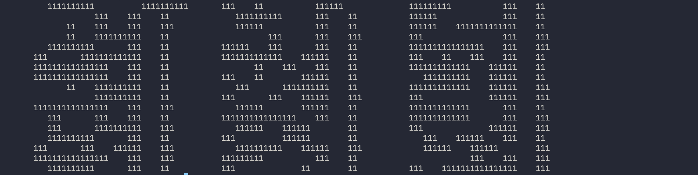
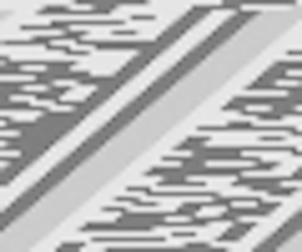
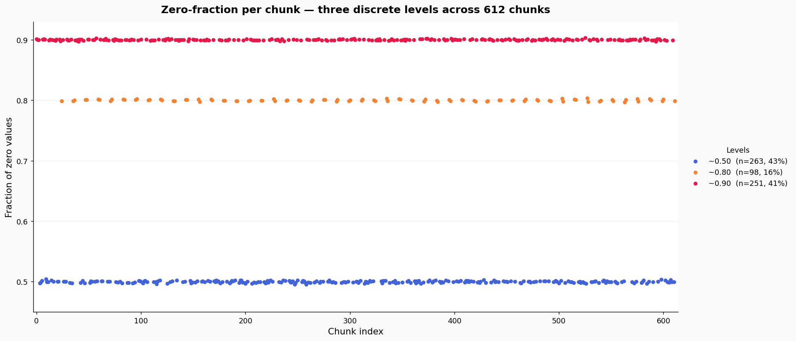

# \[GPNCTF 2026] misc/ organized

For GPNCTF 2026, teams can self designate as **Organic**. These are teams that commit to using AI as least as possible. Our team decided to try this, with more experienced players replacing AI to give guidance and hints to junior members. The reliance of AI has long been a controversial topic.

## Overview

Knowing that I wouldn't be able to use AI, I picked a chall from the category I am the most familiar with – steganography. The chall comes with a binary file with the following description, and nothing else.

> Isn't this just a file of random data? Well, maybe you just don't appreciate the organization in your life.&#x20;
>
> [Download ](https://gpn24.ctf.kitctf.de/api/challenges/handout/organized)

Besides being judged on how I live my life, the text offers not much clues. So we shift our focus to the binary file instead.

## False Lead

First thing we did was `binwalk -a` . It is quick way to check if there were any hidden files inside the file.

<figure><figcaption></figcaption></figure>

The result was interesting. It seems binwalk detected multiple GPG signed and Zlib files in the binary file. However some of the file sizes seem unusually small.

To further investigate, we installed a hex editor called **imHex**, as recommended by one of the experienced players.

imHex is a powerful tool that allows you to write your own patterns and filters. It was my first time using it, so it took me a while to get used to its Rust and C-style hybrid scripting language.

After a quick tutorial and help from teammates, I started inspecting the memory addresses where the supposed GPG and zlib files were located.

<figure><figcaption></figcaption></figure>

That was disappointing. Aside from the magic numbers, these byte sequences did not look anything like actual GPG or zlib files.

This was where I learned that binwalk is not always reliable. It mainly scans the binaries for known magic numbers, so random data can sometimes resemble a file signautre purely by chance. In this case, because zlib files often begin with `78 01`, `78 5E`, `78 9C`, `78 DA` , binwalk reported a false positive. In order words, just because binwalk reports a possible embedded file does not mean there is actually a valid file there.

## Hope

Focusing back on the binary file itself, we noticed two things.

1. The file is exactly **7,650,000 bytes**.
2. There are many `0x00` spread throughout the file.&#x20;

At first, we thought it might be an ELF file. However after inspecting the beginning, middle and end of the file, we could not find anything that looks like a valid ELF file structure. What we found instead was that there are chunks with many zeroes and that there are chunks where there are mostly random nonzeroes. So we tried splitting the file into chunks to see rather any structures would emerge. Since the file size was exactly 7,650,000 bytes, the chunk sizes would have to be one of its factors. After some trials and errors, the chunk size that divided the regions with mostly zeroes and nonzero the most cleanly is 12,500 bytes.

Then we wrote a script to count the zeroes in each chunk.

```python
with open("data", "rb") as f:
    num_chunks = 612 # 7650000 / 12500 = 612
    offset = 0
    for i in range(num_chunks):
        chunk = f.read(7650000//num_chunks)
        if not chunk:
            break
        zeroes = chunk.count(0x00)
        total = len(chunk)
        non_zeroes = total - zeroes
        offset += total
        print(f"Chunk {i}: {zeroes} zeroes, {non_zeroes} non-zeroes, total {total}, offset {offset}")
```

And here are some of the results.

```
Chunk 12: 5337 zeroes, 7163 non-zeroes, total 12500, offset 162500
Chunk 13: 5447 zeroes, 7053 non-zeroes, total 12500, offset 175000
Chunk 14: 53 zeroes, 12447 non-zeroes, total 12500, offset 187500
Chunk 15: 5386 zeroes, 7114 non-zeroes, total 12500, offset 200000
Chunk 16: 52 zeroes, 12448 non-zeroes, total 12500, offset 212500
Chunk 17: 5377 zeroes, 7123 non-zeroes, total 12500, offset 225000
Chunk 18: 5308 zeroes, 7192 non-zeroes, total 12500, offset 237500
```

The pattern is now obvious that the chunks could be divided into two types and parsed as binary code.

1. Chunks with \~50 zeroes. **(1 in binaries)**
2. Chunks with \~5500 zeroes. **(0 in binaries)**

And here is the result.

```
00011100011100101000110000111000101000000010101000011100101000110000101000
00101010100001100010100011011110100000101110100000010010100010000010100001
11001010001101001010001111101010001001111010001111011010001010101010001111
10101000001010101000111101101000111110101000101001101000011101101000001011
10100001001110100011110110100000001110100010010110100010000110100011111010
10000110011010001111001010000100101010001111101010001111001010000100111010
00011011001000100001101000011100101000100011001000010110101000100101101000
01110110100001101100100011111010100011100010100000001010100001110010100010
00010010001011111010
```

We tried looking for the flag prefix `GPNCTF` in the code, both as ASCII binary (`01000111 01010000 01001110 01000011 01010100 01010101`) and as Base64 (`Z3BuY3Rm`), but we could not find any matching string.&#x20;

In addition, we noted that the length of decoded binaries is not divisable by 8. So we conluded that the flag is probably not directly encoded in the data. (Big mistake!)

## The Rabbit Hole

<figure><figcaption><p>There are definitely some sorts of pattern in the code.</p></figcaption></figure>

After abandoning the earlier appraoch, we started experimenting with different approaches:

1. Different chunk sizes.
2. Count the zeroes on bit level instead of byte level. (Which makes no difference)
3. Using the ratio of zeroes in each chunk as a pixel in a greyscale bitmap.

<figure><figcaption><p>We though maybe it is a QR code taken at a weird angle.</p></figcaption></figure>

But nothing worked.  At this point, we are exhausted. And the final blow that finally broke my brain was this vertical image.&#x20;

<figure><figcaption><p>Cropped version of the vertical image.</p></figcaption></figure>

The image is generated with the chunk size of 5000 bytes and rendered as a 6 x 255 image.

```python
from PIL import Image

with open("data", "rb") as f:
    num_chunks = 1530
    width, height = 6, 255 

    pixels = []
    for i in range(num_chunks):
        chunk = f.read(7650000 // num_chunks)
        if not chunk:
            break
        non_zeroes = int.from_bytes(chunk, "big").bit_count()
        total = len(chunk) * 8
        zeroes = total - non_zeroes
        pixels.append(int(zeroes / total * 255))

    img = Image.new("L", (width, height))
    img.putdata(pixels)
    img.save("output.png")
```

At that point, we have probably spent more than ten hour on this chall. And to my flag deprived brain, the image looks like a string written in a funky font, yet I just couldn't decipher what the actual characters are written. After starring at it for an embarrassing amount of time, It was getting really late, and we called it a day.

## Mistakes

Due to other obligations, we didn't manage to solve the chall before the CTF was over. And then we found out how close we were actually to the flag. Along the way, we made two fatal mistakes.

1. **Not checking bit reversal:** when we were looking for the flag prefix `GPNCTF` in the binary code, we didn't check the ASCII binary in reversal (`11100010 00001010 01110010 11000010  00101010 10101010)` . It would have reveal the flag immediately.

<figure><figcaption></figcaption></figure>

2. **Not graphing the data:** the assumption that there are only two types of chunks is wrong. If we had actually graphed the number of zeroes in each, it would have had shown there are actually three types.

<figure><figcaption></figcaption></figure>

And the parsed output would had made the reversed ASCII bits more obivous.

<figure><figcaption></figcaption></figure>

## Self Reflection

Looking back at our mistakes, we recognize that one of the shortcomings of relying too heavily on AI: **it is easy to overlook important details, even when the overall idea is on the right track.** AI is usually very good at taking care of the more nuanced parts of pattern matching and execution, while the human's job is steer it in the right direction. But once we took AI away, we became blind to things that were right in front of us the whole time, like the flag.
