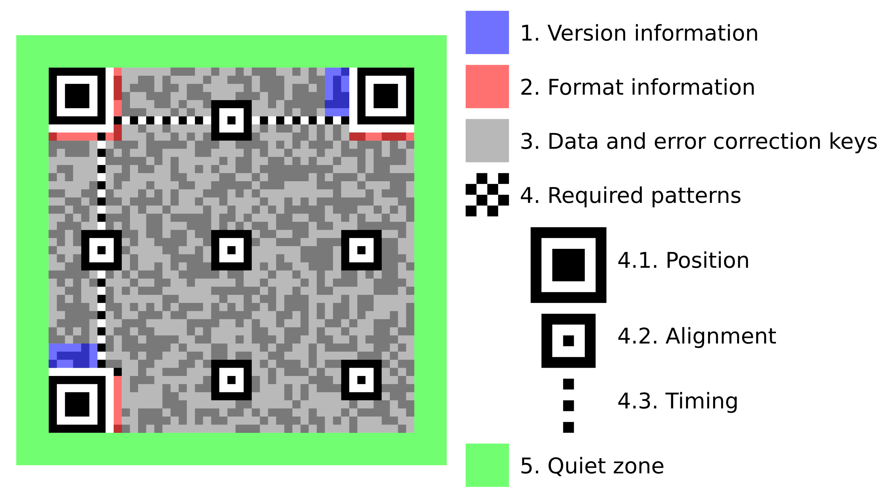
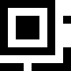
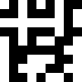

# \[lactf2026] misc/error-correction

> #### **Flag Objective:**
>
> Reconstruct a shuffled QR code.
>
> #### **Description:**&#x20;
>
> Looks like their error correction's no match for my error creation!
>
> #### <sup>**Files:**</sup>
>
> * [chall.png](https://github.com/uclaacm/lactf-archive/blob/main/2026/misc/error-correction/chall.png)
> * [chall.py](https://github.com/uclaacm/lactf-archive/blob/main/2026/misc/error-correction/chall.py)
>
> [<sub>https://github.com/uclaacm/lactf-archive/tree/main/2026/misc/error-correction</sub>](https://github.com/uclaacm/lactf-archive/tree/main/2026/misc/error-correction)

First thing I did was throwing the shuffled QR code and the python [script](https://github.com/uclaacm/lactf-archive/blob/main/2026/misc/error-correction/chall.py) into LLM to get freebies without spiking my cortisol. From the script, the LLM  identified this is a gen 7 QR code that has been divided into 5x5 pieces and scrambled. And to solve the challenge, we just need to put the 25 pieces back into order.

<figure><figcaption></figcaption></figure>

To do that, I (with the help of LLM) wrote a script to slice 25 chunks with equal size. And reverse engineer the QR skeleton such its Finders, Alignment and Timing pieces. Finders are the chunks with the big squares, Alignment are the chunks with smaller squares, Timing are the chunks with the dotting lines. The Finder and Alignment pieces are relatively easy to find as each chunk has a distinctive square position. (e.g. The middle alignment  has a small square in the middle of the chunk, the bottom alignment has a small square at the top of the chunk, etc). With the help of  Version Information bits, the Timing pieces are also identified. These are 13 out of 25 pieces solved.

To continue, we must find out what masking is the QR code using. I looked at the script, hoping I would find that information. Unfortunately, the masking mode parameter is not specificied. Instead, we rely on `segno` to automatically choose the best masking.

`qr = segno.make(flag, mode='byte', error='L', boost_error=False, version=7)`

#### What is Masking?

> To avoid big blobs of white/black area, we run the raw QR code through one of the eight masking pattern to make sure we have a machine readable QR code.

To find out which version of masking we are using, we can use the **Format information** in the QR code. You can find it at the top left Finder chunk. ( The Top Right and Bottom Left Finders each contain half of the Format information as a form of redundancy, in cae the QR code is damaged ).&#x20;

<figure><figcaption></figcaption></figure>

The Format information itself is masked. To unmask it,we must unmask it by XORing it with `101010000010010` . (Unlike the data, the Format information always uses the same mask.)

```
Masked bits:  111 0111 1001 0001
XOR mask:     101 0100 0001 0010
Reuslt:       010 0011 1000 0011
```

To read the result,

```
Error Correction (2 bits) : 01
Mask Pattern (3 bits): 000
BCH Error-Correction (10 bits) : 11 1000 0011
```

So now we know we are using Mask 0 which is

> &#x20;$$(i+j)(mod2)==0$$&#x20;

which means if the sum of x and y coordinates is divisible by 2 then XOR with 1.

Using LLM, I wrote a script that can unmask a chunk of the QR code, provided we know we know exactly the coordinates of its bits. Using that script, I unmasked the chunk at the bottom right ( where QR code begins).

<figure><figcaption></figcaption></figure>

In the unmasked chunk, we start from the bottom right bit, then its left, then diagonally top right, then left, and repeat. In our case, the first byte is `0100 0100` , followed by `0111 0101`. The first four bits is our mode bits. (`0100` is byte mode which matches our script, feel free to consult the internet for other mode codes). And the next eight bits are the length bits which is `0100 0111`  or 71 in decimal. So now we know the flag has a length of 71. Then we try to read the first char of our flag which we know is 'l' which is `01101100` (or `01001100` for uppercase). However, our next four bits are `0101` , which means something is wrong!

After consulting with teammates, LLM and the Internet. I realized the raw bytes in QR code are not sequential but actually interleveled. Meaning when you read the bytes, they alternative into two sets.&#x20;

In our case, it means it means after first byte `0100 0100`, it is not followed by the second byte `0111 0101` but rather the third byte, we only know partialy, `11xx xxxx`. That also means the chunk above the bottom right must have `xx01 10xx xxxx xx11 0001 10xx` you read from the botton right zig zag up.&#x20;

Once we found the matching chunk. We now know the correct length of our flag is `0100 1111`  which is 79.

We use the QR generation script, using a dummy flag with the same length, commenting out the shuffle line, we generate variants of the QR code. And there notice that in every chunk, there are parts that look similar to our sliced up chunks. That is because because our data is only 79 chars, there are many padding bits that would look the same independent of the actual value of the data.

With this pattern method, we are left with only 7 unidentified pieces, which we brute forced easily.
