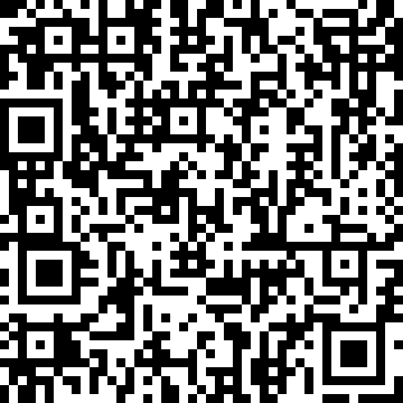

# \[lactf2026] misc/error-correction

Flag Objective: Reconstruct a shuffled QR code.

<figure><figcaption></figcaption></figure>

First thing I did was throwing the shuffled QR code and the python [script](https://github.com/uclaacm/lactf-archive/blob/main/2026/misc/error-correction/chall.py) into LLM to get freebies without spiking my cortisol. From the script, the LLM  identified this is a gen 7 QR code that has been divided into 5x5 pieces and scrambled. And to solve the challenge, we just need to put the 25 pieces back into order.

To do that, I (with the help of LLM) wrote a script to slice 25 pieces with equal size. And reverse engineer the QR skeleton such its Finders, Alignment and Timing pieces. Finders are the pieces with the big squares, Alignment are the pices with smaller squares, Timing are the pieces with the dotting lines.

<figure><figcaption></figcaption></figure>

to be continued.
